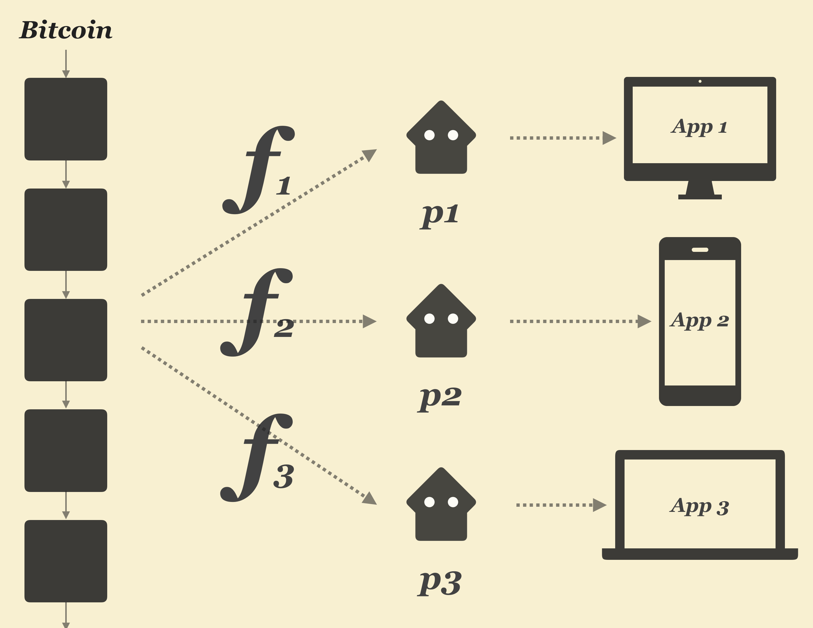
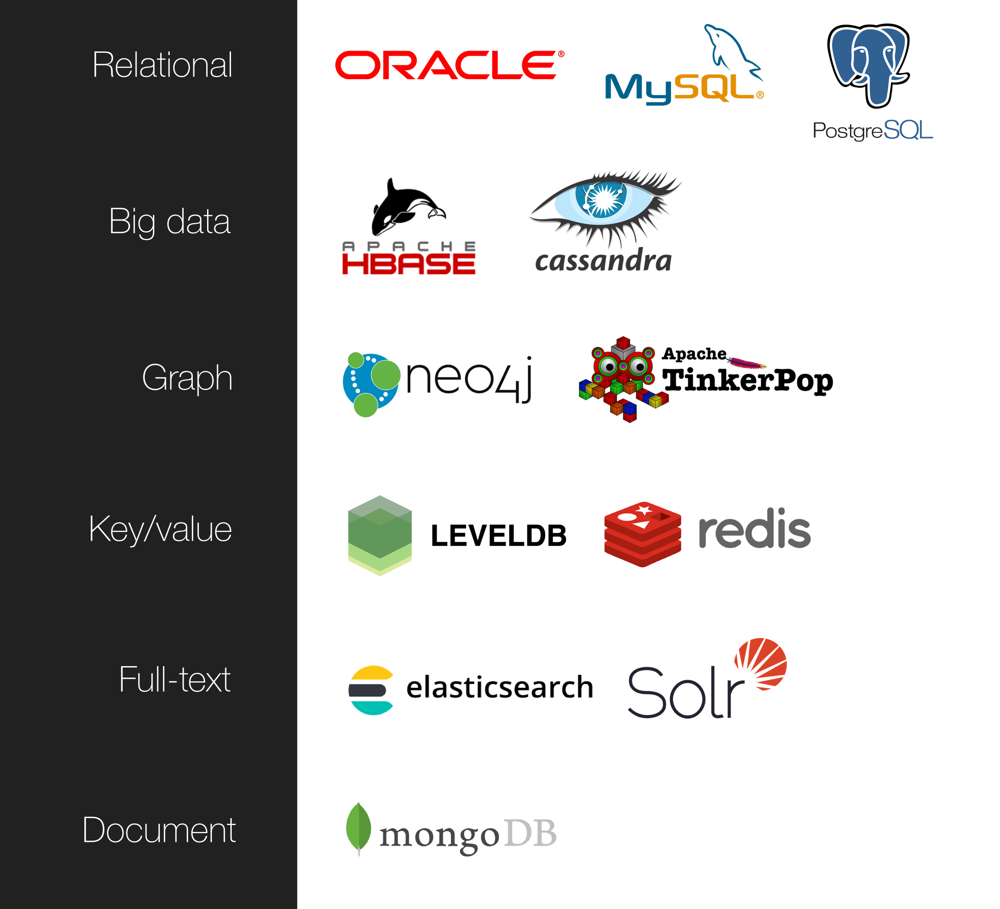
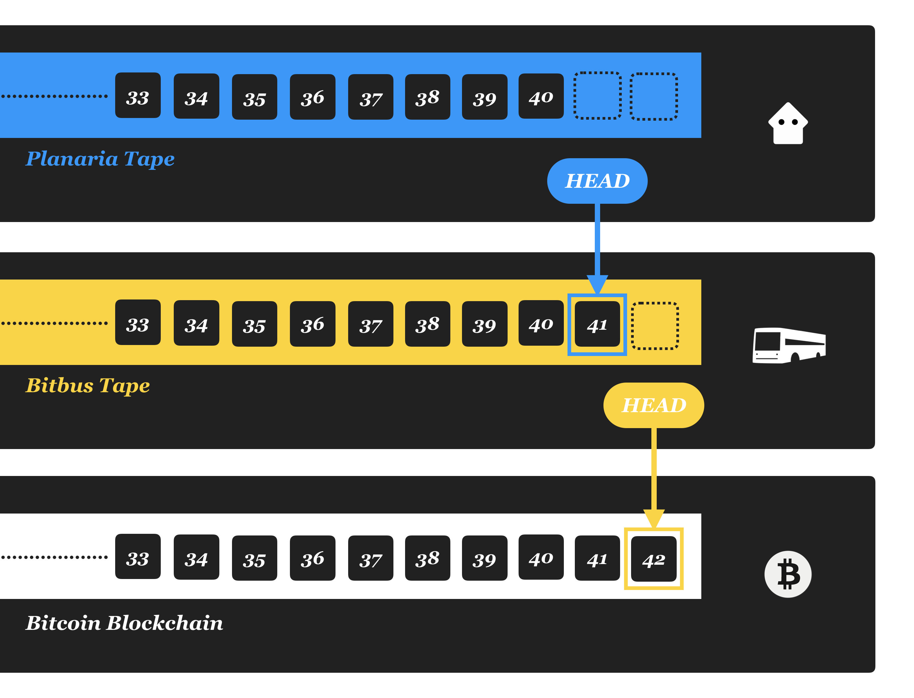
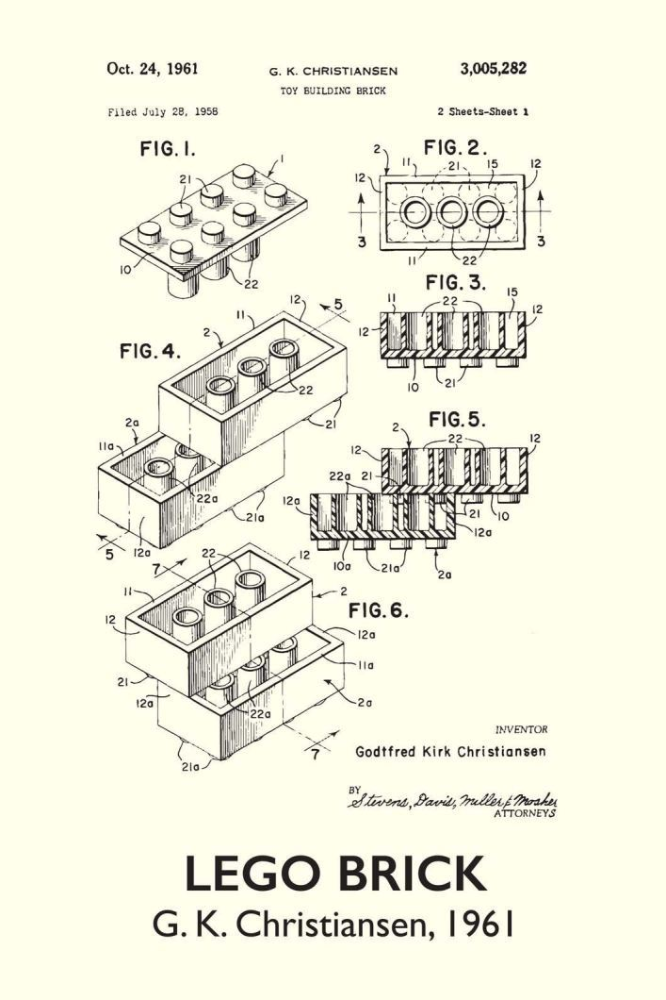
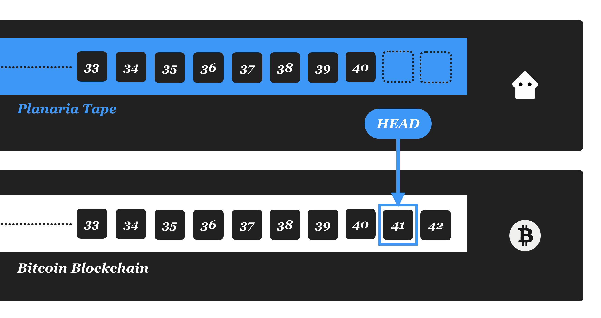
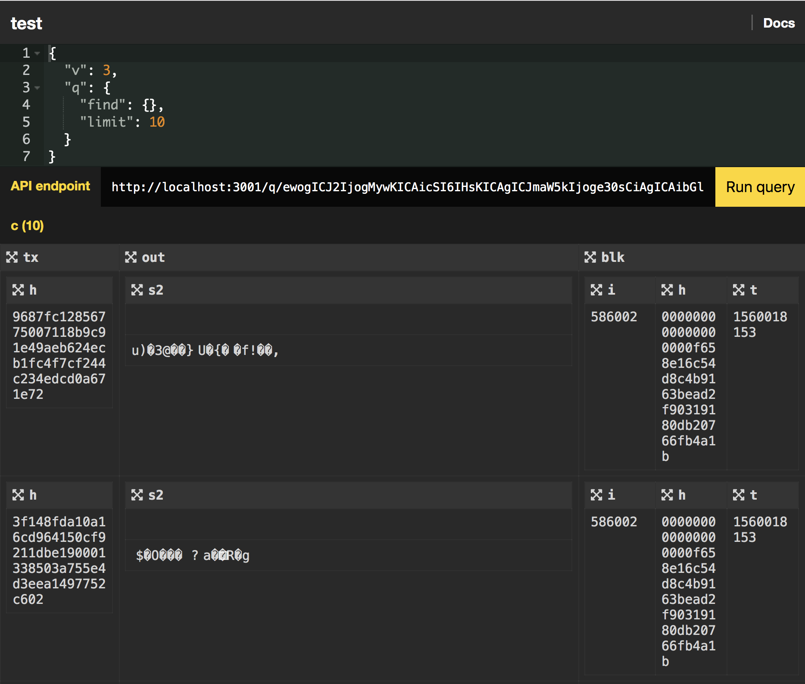
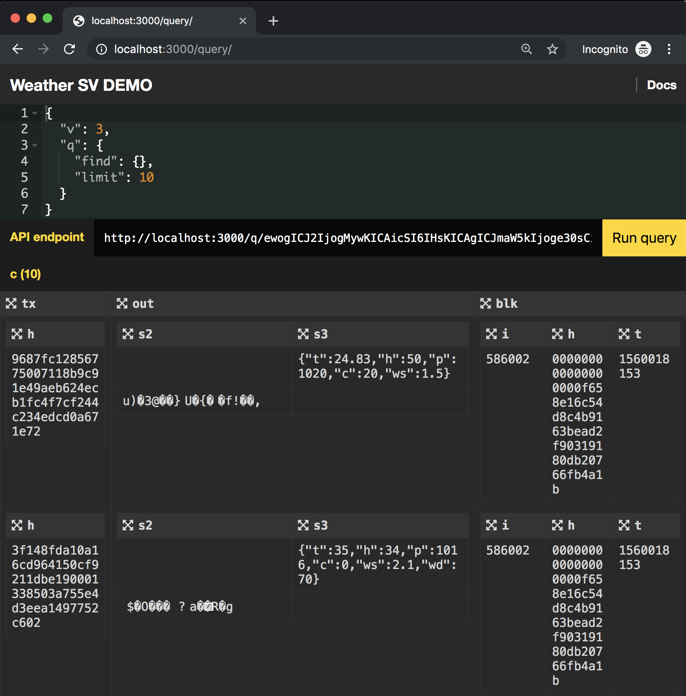
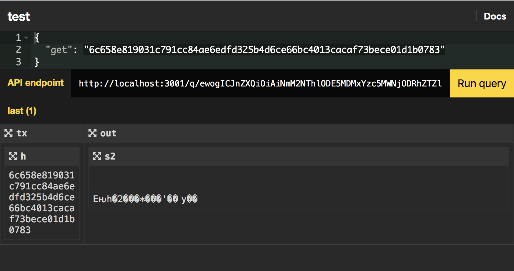

# Neon Planaria

> Bitcoin as Backend

Neon Planaria is a new version of [Planaria](https://docs.planaria.network) which is completely re-written from scratch.

It is drastically simplified yet exponentially more powerful.

The main design goals are: **simplicity and flexibility**:

1. **Easy:** Easy to use. Minimal syntax. No framework quirks. NO SETUP to get started.
2. **Simple:** Minimal framework. Does what it's good at and gets out of the way.
3. **Flexible:** Simplicity begets flexibility. Effortless interface with any database system, any library, any 3rd party process, any container.

---

# What it does

Planaria lets you build ANY API backend system from Bitcoin.



The framework is made up of two components:

1. **Planaria:** Create an autonomous state machine from Bitcoin. Planaria keeps synchronizing itself with the Bitcoin blockchain and programmatically generates a derivative state machine by using Bitcoin transaction events as command. You can derive ANY state machine you want since Planaria lets you write a JavaScript program to transform and store Bitcoin transactions into any format you want.
2. **Planarium:** Create an API endpoint from the generated Planaria state machine. Planarium provides an explorer and an API endpoint, along with a built-in convention to design your own JSON query language like [Bitquery](https://docs.planaria.network/#/query).

---

# Features

## 1. Zero barrier

Neon Planaria is as minimal and as easy as it can get. 

No hassle to set up containers, no hassle to worry about ports and firewalls.

No requirement to set up a whole infrastructure and download hundreds of gigabytes of blockchain to do anything, thanks to built-in [Bitbus support](https://bitbus.network). (Of course, it also gives the option to plug in a Bitcoin full node later if needed)

> **It's literally a single node.js app.** 


All it takes is an `npm install`, and you're set to go.


## 2. No limits

Planaria used to have a constrained architecture. It used to be wrapped inside a Docker container, was powered by MongoDB only, and had a quirky & complicated declarative syntax you needed to learn.

**Neon Planaria has no such constraints and no limits.**

It achieves this goal by throwing away all the bloat which existed in the previous version of [Planaria](https://docs.planaria.network) and becoming minimal.

Now you can do whatever you want, including using any Database system:




Planaria can integrate with as many 3rd party technology as possible. You can integrate with any persistence system such as:

- graph database: Neo4J, Apache Tinkerpop
- full text index: Elasticsearch, Solr, etc.
- relational database: PostgreSQL, MySQL, Oracle, etc.
- key/value database: LevelDB, Redis, etc.
- Bit data database: HBase, Cassandra, etc.
- document database: MongoDB
- decentralized storage: Git, DAT, IPFS, BitTorrent, etc.
- append only logs/message queue: Kafka, RabbitMQ, ZeroMQ, etc.
- file storage: S3, etc.

But that's not all. The whole point is that there is no limitation anymore:

### No container restrictions

You can employ as many containers as you want concurrently. 

For example, you can power ALL of Elasticsearch, MongoDB, and even Kafka from a single Planaria application. 

This is made trivial because Planaria itself is no longer a container, but has become an engine that can operate anything, including interacting with multiple containers, executing 3rd party programs, and even making system calls.

### Blend into existing workflow

The Planaria part of the framework has two methods: `start` and `exec`, and that's it. 

- `planaria.start(engine_description)` for starting the engine.
- `planaria.exec(cmd, [args])` for making system calls, which can do things like pulling and running a docker container.

You can mix and match with your existing backend or workflow.


---

# How it works

At the core of Neon Planaria is a data structure abstraction called "Tape".

## 1. A tape is proof of work

Neon Planaria introduces a concept called "Tape". It's a similar to [Turing machine](https://en.wikipedia.org/wiki/Turing_machine)'s tape in that it's about task execution, but also very different. Here are the highlights:

1. The tape moves one direction: forward.
2. Tape is for keeping track of work accomplished.
3. Work may happen on-tape or off-tape.
4. Work is publicly published, which allows anyone to easily verify the work themselves.
5. Work can write back to the tape, but this is optional.
6. The root of all tapes is Bitcoin.


By looking at Bitcoin as a **never-ending tape that grows every ten minute or so**, we can even view Bitcoin as a form of "tape".

However in our case we don't use the term "tape" just for abstract discussion. We actually use it as a common data structure for all bitcoin derived systems.

Here's what a "Tape" file looks like:

```
BLOCK 586466 1560303091152
BLOCK 586467 1560303091210
BLOCK 586470 1560303091262
BLOCK 586473 1560303091287
BLOCK 586474 1560303091302
BLOCK 586475 1560303091309
BLOCK 586476 1560303091316
BLOCK 586477 1560303091335
BLOCK 586479 1560303091364
BLOCK 586480 1560303091385
BLOCK 586481 1560303091402
BLOCK 586482 1560303091408
BLOCK 586485 1560303091528
BLOCK 586489 1560303091603
BLOCK 586490 1560303091609
MEMPOOL 375f4baf69165b2954ca3a00230d8960e9290aa8dfba0357ba55407126b6a0c8 1560303101744
MEMPOOL 683dfe2d72e616af3f97bb8dbd5b469f3fe35ff6b606dd8798877e1efa3c8675 1560303101747
MEMPOOL af9938fed7846b4abc42b423a6afb14b0a179f01555f8bbad96455f9f470a8ec 1560303101751
MEMPOOL 21684f65ff4d2cff0875b6a3864f74948a4b58cf529bf9504f528496a5ca6ba0 1560303101754
MEMPOOL f10f0c0cd28c20cdd03da29dde335d4290d9641085a0d64b03288cfab8ae325b 1560303101758
MEMPOOL cb02e4325a622923d14af2b8ab867246d66ef92829d8bb529d8d11da27b1fad9 1560303101760
MEMPOOL c972d7209c066322e734fc54a23e9dd743df092e78e95ea52391f96d9a0f0d3c 1560303101780
MEMPOOL f3e77c3cba1de6ee9824f1f0c864b4ec0380e19c741a20e7c8e9130146027be4 1560303101784
MEMPOOL ab37ccd46baffadbd3ec215cbd7247788145a15a0ac50eb9ef86a621413df5da 1560303101787
```

It's essentially an event log of everything that has been successfully processed.

In other words, the tape is a "proof of work", because it proves that the system has completed the corresponding task. Depending on the system, the concept of "work" may have different meaning. For example:

1. On Bitcoin, "work" means a miner successfully finding a hash.
1. On Bitbus, "work" means successfully synchronizing filtered blocks from the source bus.
2. On Planaria, "work" means successfully and atomically processing all the events from its data source (which can either be Bitcoin or Bitbus)


## 2. A tape wants to synchronize

Neon Planaria uses this tape abstraction to deal with synchronization in a robust and scalable way.

Here are the properties of a tape:

1. A tape is ALWAYS updated as a result of certain atomic unit of work being accomplished.
2. A tape always has a source data stream it subscribes to (Except for Bitcoin, since Bitcoin is the ultimate source of truth)
3. A tape wants to synchronize with its source data stream.

Here's what it looks like at high level:



We start from the bottom up.

1. Bitcoin doesn't have any source tape, since it's THE tape.
2. Bitbus has a "HEAD" that watches Bitcoin "tape" and tries its best to synchronize.
3. Planaria has a "HEAD" on Bitbus tape, and tries its best to synchronize with Bitbus.

Note "synchronize" has a different meaning for each system.

```
[Bitcoin]
  => [Bitbus Processor] => [Bitbus] => [Bitbus Tape]
  => [Planaria Processor] => [Planaria] => [Planaria Tape]
```

The goal for the Bitbus tape is to keep track of its progress of synchronizing with Bitcoin subset.

And the goal for the Planaria tape is to keep track of its Bitbus event processing progress (Planaria takes Bitbus events and executes its own state transition code inside `onblock` and `onmempool`)

1. When Bitbus synchronizes its subset replication with Bitcoin, it creates a tape that logs all the events it has successfully processed.
2. In the meantime, Planaria is also watching Bitbus tape in order to react in realtime.
3. When Bitbus synchronizes a block, it updates its own tape.
4. Then Planaria uses that Bitbus tape event to trigger its `onmempool` or `onblock` handler.
4. After successfully finishing the `onmempool` or `onblock` handlers, Planaria updates its own tape to mark its progress.
5. If either of these modules crashes, both tapes will always have the last successfully processed event as the last item on the tape, so they will naturally resume where they left off.

## 3. A tape wants to stick

The main benefit of this tape abstracton is that it allows for easy plug in and out of other tapes, like Lego.



Just like Lego lets you mix and match blocks with a common interface, Planaria requires minimal common interface.

Planaria has a syntax that lets you filter incoming transactions with a query language ([Bitquery](https://docs.planaria.network/#/query)):


```
planaria.start({
  filter: {
    from: 570000,
    q: {
      "find": { "out.s1": "1LtyME6b5AnMopQrBPLk4FGN8UBuhxKqrn" },
      "project": { "out.s2": 1, "out.s3": 1 }
    }
  },
  ...
})
```

### Bitbus-Planaria binding

For example, you start a Neon Planaria node with above code, using Bitbus:

1. The command sets up a Bitbus node that only synchronizes a subset of the blockchain that matches above query.
2. Then it feeds the entire bitbus stream into Planaria.

### Bitcoin-Planaria binding

In case of Bitcoin-Planaria binding (Not yet available, work in progress), here's how it would work:

1. Since we have the entire blockchain, we have all the transactions.
2. The crawler fetches the transactions and filters them with the same query filter before triggering `onmempool` or `onblock`.
3. The result is we still have the identical filtered dataset as the bitbus option above, but straight from Bitcoin.

This way, we can easily plug Planaria in and out of Bitbus and Bitcoin with 100% identical code. 

For example, here's what a direct Bitcoin-Planaria binding may look like:



Also there are other ways to implement the binding thanks to the tape abstraction. All those options will be explored when building the Bitcoin-Planaria binding.


> NOTE: Currently **only the Bitbus-Planaria binding** has been implemented. Bitcoin-Planaria binding is coming soon.


---

# Syntax

## 1. Planaria State Machine

There are two methods for `planaria`:

1. `planaria.start(engine_description)` for starting the engine.
2. `planaria.exec(cmd, [args])` for making system calls, which can do things like pulling and running a docker container.

### 1.a. planaria.start

The following is the entirety of the syntax. To see an actual example, check out [Tutorial](#tutorial)

```
const { planaria } = require("neonplanaria")
planaria.start({
  filter: {
    from: [BLOCK HEIGHT TO PROCESS FROM],
    q: [BITQUERY FILTER]
  },
  onstart: function(e) {
    /*********************************************************************
    *
    *   Called whenever the app starts.
    *
    *********************************************************************/
  },
  onmempool: async function(e) {
    /*********************************************************************
    *
    *   Called whenever there's a new mempool transaction.
    *   Includes an "e" payload with child attributes:
    *   - tx: the full transaction object in TXO format
    *   - tape: current state machine status, represented as "tape"
    *
    *********************************************************************/
  },
  onblock: async function(e) {
    /*********************************************************************
    *
    *   Called whenever there's a new block.
    *   Includes an "e" payload with child attributes:
    *   - height: current block height
    *   - tx: an array of all filtered transaction objects in TXO format
    *   - tape: current state machine status, represented as "tape"
    *
    *********************************************************************/
  }
})
```

- `filter`: The Bitquery filter to filterr all raw transactions before triggering `onmempool` or `onblock`.
  - `from`
  - `q`: A subsiet of [Bitquery](https://docs.planaria.network/#/query?id=q) to filter the incoming events. 
- `onstart`: called whenever the app starts. You can initialize anything you want in here.
- `onmempool`: called whenever there's a new mempool transaction. The callback payload `e` has the following attributes:
  - `tx`: [TXO representation](https://github.com/interplanaria/txo) of the incoming bitcoin transaction.
  - `tape`: [tape](#tape) object that represents the current processing status.
    - `src`: the source tape
      - `start`: the source tape start point. If using Bitbus, it will be the first block from which the bitbus node started synchronizing.
      - `end`: the source tape end point.
    - `self`
      - `start`: the block height from which the current app started processing from. This would be the first line of the `tape.txt` file in youre execution environment.
      - `end`: the last block height which was successfully processed by Planaria.
- `onblock`:
  - `tx`: An array of [TXO representation](https://github.com/interplanaria/txo) of the incoming bitcoin transaction.
  - `tape`: [tape](#tape) object that represents the current processing status.
    - `src`: the source tape
      - `start`: the source tape start point. If using Bitbus, it will be the first block from which the bitbus node started synchronizing.
      - `end`: the source tape end point.
    - `self`
      - `start`: the block height from which the current app started processing from. This would be the first line of the `tape.txt` file in youre execution environment.
      - `end`: the last block height which was successfully processed by Planaria.

### 1.b. planaria.exec

Planaria also gives a way to make system calls. This way you can orchestrate outside processes, 3rd party engines, and even Docker containers all from your single Planaria `node.js` app.

```
planaria.exec(cmd[, args][,options])
```

This internally utilizes [child_process.spawn](https://nodejs.org/api/child_process.html#child_process_child_process_spawn_command_args_options) natively, but returns a Promise, so you can wait for the process to finish.

This is great for pulling and running containers and waiting until it finishes.

```
await planaria.exec("docker", ["pull", "mongo:4.0.4"])
await planaria.exec("docker", ["run", "-d", "-p", "27017-27019:27017-27019", "-v", process.cwd() + "/db:/data/db", "mongo:4.0.4"])
```

---

## 2. Planarium API Endpoint

What good is a state machine if you can't access the data inside?

Planarium is the module that gives you an instant API as well as a default explorer UI.

```
const { planarium } = require('neonplanaria')
const path = require('path')
planarium.start({
  name: <API name>,
  port: <port>,
  onstart: async function() {
    /***************************************************************************
    *
    * Initialize and construct the core object.
    * - return the constructed core.
    * - the core will be accessible as "core" attribute inside "onquery" & "custom"
    *
    ***************************************************************************/
  },
  onquery: function(e) {
    /***************************************************************************
    *
    * Triggered for every HTTP GET request to "/q/:query"
    *
    * e := {
    *   query: <base64 encoded query string>,
    *   res: <express.js res object>,
    *   core: <whichever object that was constructed and passed back from onstart>
    * }
    *
    ***************************************************************************/
  },
  custom: function (e) {
    /***************************************************************************
    *
    * Override expressjs app object
    *
    * e := {
    *   app: <express.js app object>,
    *   core: <whichever object that was constructed and passed back from onstart>
    * }
    *
    ***************************************************************************/
  },
})
```

### Attributes

- `name`: name of the API endpoint, this will show up as the title of the API explorer UI.
- `port`: port to use to serve HTTP
- `onstart`: initialization step. If you need to initialize certain engines such as DB, initialize here, and return as return value, and it will be available inside `onquery` as `e.core` attribute.
- `onquery`: [expressjs GET route handler](https://expressjs.com/en/starter/basic-routing.html) for the path: `/q/:query`. See above code comment for details.
- `custom`: Override express.js `app` object. Not only can you attach more `GET` routes, but you can aleven attach `POST` requests to submit ANYTHING. As for **what** you can submit, use your imagination...

### Customization

You can attach more endpoints through `custom()`.

This means you now can even POST things, such as uploading content, etc.

```
const express = require('express')
const { planarium } = require('neonplanaria')
planarium.start({
  ...
  custom: function (e) {
    e.app.use(express.json());
    e.app.post('/broadcast', (req, res) {
      // do something with:
      // req.body
    })
  },
  ...
})
```


---

# Tutorial


## Build a Planaria State Machine

Let's build a [WeatherSV](https://weathersv.app) State Machine.

First, here's the entire source code for creating a WeatherSV state machine:

```
const { planaria } = require("neonplanaria")
const MongoClient = require('mongodb')
const path = require('path');
var db;
var kv;
const connect = function(cb) {
  MongoClient.connect("mongodb://localhost:27017", {useNewUrlParser: true}, function(err, client) {
    if (err) {
      console.log("retrying...")
      setTimeout(function() {
        connect(cb);
      }, 1000)
    } else {
      db = client.db("planaria");
      cb();
    }
  })
}
planaria.start({
  filter: {
    "from": 566470,
    "q": {
      "find": { "out.s1": "1LtyME6b5AnMopQrBPLk4FGN8UBuhxKqrn" },
      "project": { "out.s2": 1, "out.s3": 1 }
    }
  },
  onmempool: async function(e) {
    await db.collection("u").insertMany([e.tx])
  },
  onblock: async function(e) {
    await db.collection("c").insertMany(e.tx)
  },
  onstart: function(e) {
    return new Promise(async function(resolve, reject) {
      if (!e.tape.self.start) {
        await planaria.exec("docker", ["pull", "mongo:4.0.4"])
        await planaria.exec("docker", ["run", "-d", "-p", "27017-27019:27017-27019", "-v", process.cwd() + "/db:/data/db", "mongo:4.0.4"])
      }
      connect(function() {
        if (e.tape.self.start) {
          db.collection("c").deleteMany({
            "blk.i": { "$gt": e.tape.self.end }
          }).then(resolve)
        } else {
          resolve();
        }
      })
    })
  },
})
```

Let's first try it out before walking through code. 

First, save the file above as `index.js`.

Then install the dependencies (`neonplanaria` and `mongodb`)

```
npm install --save neonplanaria mongodb
```

Also, as you can see in the code just for this project you will need to install Docker if you haven't already

- [Install Docker for Mac](https://docs.docker.com/docker-for-mac/install/)
- [Install Docker for Windows](https://docs.docker.com/docker-for-windows/install/)
- [Install Docker for Linux, etc.](https://docs.docker.com/v17.12/install/#server)

> NOTE: **Docker is not mandatory, you only need to install it if YOUR app requires running a docker container.** In this case we want to run a MongoDB docker container so we are installing it.

Now run the app!

```
node index
```

Now, let's walk through the code line by line.

### 1. Requiring modules

```
const { planaria } = require("neonplanaria")
const MongoClient = require('mongodb')
const path = require('path');
var db;
var kv;
```

First, we require `neonplanaria` and use the `planaria` module.

Next, for this project we use MongoDB as database, so we require `mongodb`.

Lastly, we declare some global variables.

### 2. Database connection function

Before we begin, let me emphasize that Neon Planaria is not tied to a single Database system, you can use anything. But in this case we're using MongoDB.

```
const connect = function(cb) {
  MongoClient.connect("mongodb://localhost:27017", {useNewUrlParser: true}, function(err, client) {
    if (err) {
      console.log("retrying...")
      setTimeout(function() {
        connect(cb);
      }, 1000)
    } else {
      db = client.db("planaria");
      cb();
    }
  })
}
```

We then create a `connect` function, which:

1. creates a MongoDB connection to `mongodb://localhost:27017`
2. if it fails, try reconnecting every second until it succeeds
3. once it finally connects, it returns with a callback `cb()`

### 3. Planaria start

Here's the rest of the code. This single command starts the planaria machine.

```
planaria.start({
  filter: ...,
  onmempool: ...,
  onblock: ...,
  onstart: ...,
})
```

Now let's walk through each attribute.

### 4. filter

This is a [Bitquery](https://docs.planaria.network/#/query) filter which filters every transaction event.

You can think of this as the filter that everything must go through before reaching any of `onmempool` or `onblock` callbacks, which we will discuss in the next section.


```
planaria.start({
  filter: {
    "from": 566470,
    "q": {
      "find": { "out.s1": "1LtyME6b5AnMopQrBPLk4FGN8UBuhxKqrn" },
      "project": { "out.s2": 1, "out.s3": 1 }
    }
  },
  ...
})
```

So in this case, here's how the `filter` would work:

1. **New mempool transaction event:** Check the pattern to see if it matches the query inside `"q.find"`. If it does, then `onmempool()` is triggered, and the `project`ed result is passed in as `tx` object.
2. **New block event:** Filter the entire transaction set with the `"q.find"` filter and only send the matching results underr `tx` array.

WeatherSV's OP_RETURN protocol always starts with the first push data of `1LtyME6b5AnMopQrBPLk4FGN8UBuhxKqrn`, so any transaction with an output that matches this pattern will come through this filter.

### 5. onmempool

Whenever there's a new mempool transaction that passes the `filter` test, `onmempool()` will be triggered.

Here we call:

```
await db.collection("u").insertMany([e.tx])
```

to insert the transaction item into a collection named `"u"` (for 'unconfirmed')


### 6. onblock

Whenever there's a new block, all its transactions go through the `filter` test, and only the ones that pass the test are passed in as the `tx` attribute array.

Here we call:

```
await db.collection("c").insertMany(e.tx)
```

Same as above, but this time we insert into a collection named `"c"` (for 'confirmed')

> Note that these are just arbitrary collection names and you can name them whatever you want.


### 7. onstart

This is called every time this app starts.

You can check the `e.tape` object to determine the current state of the source (Bitcoin/Bitbus) and the current machine.

The `onstart` is always triggered with a message object which looks like this:

```
{
  head: <the last processed height>,
  tape: {
    src: {
      start: <source tape start height>,
      end: <source tape end height>
    },
    self: {
      start: <machine's own tape start height>,
      end: <machine's own tape end height>
    }
  }
}
```

Currently Neon Planaria only supports Bitbus, so the above object could be interpreted as:

```
{
  head: <planaria last processed height>,
  tape: {
    src: {
      start: <bitbus start height>,
      end: <bitbus end height>
    },
    self: {
      start: <planaria start height>,
      end: <planaria last processed height>
    }
  }
}
```

With this knowledge let's look at the code.

```
planaria.start({
  ...,
  onstart: function(e) {
    return new Promise(async function(resolve, reject) {
      if (!e.tape.self.start) {
        await planaria.exec("docker", ["pull", "mongo:4.0.4"])
        await planaria.exec("docker", ["run", "-d", "-p", "27017-27019:27017-27019", "-v", process.cwd() + "/db:/data/db", "mongo:4.0.4"])
      }
      connect(async function() {
        if (e.tape.self.start) {
          db.collection("c").deleteMany({
            "blk.i": { "$gt": e.tape.self.end }
          }).then(resolve)
        } else {
          resolve();
        }
      })
    })
  },
  ...
})
```

First we check if `e.tape.self.start` exists. If it doesn't, it means this is a fresh Planaria, so we can take care of various one-time initiazliation things such as setting up a Docker container.

For pulling and running a container, Planaria provides a convenience method named `exec`, whose first argument is the command, and the second is an array of arguments.

Note that this step is only run once when the state machine first starts running.

> You can easily reset the tape by simply deleting the `tape.txt` file, which keeps the tape.

After all that's done, we now connect to the MongoDB instance. We call the `connect()` function we implemented above, and when it's succesful, we run:

```
if (e.tape.self.start) {
  await db.collection("c").deleteMany({
    "blk.i": { "$gt": e.tape.self.end }
  })
}
```

This checks if `e.tape.self.start` exists (which would mean this is an existing Planaria, therefore means the app is restarting), and then deletes any potentially dangling items that may exist.

This is because the container or the app may have crashed in the previous session while the next block was processing, and we don't want to re-process the items which may already have been applied to the database.


---

## Build a Planarium API Endpoint

Planarium lets you instantly design your own JSON query language as well as lets you make use of the built-in explorer UI.

As long as you follow the convention, it gives you:

1. a portable and transparent API
2. a query explorer

right out of the box.




First, here's the full source code for the app:

```
const { planarium } = require('neonplanaria')
const bitquery = require('bitquery')
planarium.start({
  name: "Weather SV DEMO",
  port: 3000,
  onstart: async function() {
    let db = await bitquery.init({ url: "mongodb://localhost:27017", address: "planaria" });
    return { db: db };
  },
  onquery: function(e) {
    let code = Buffer.from(e.query, 'base64').toString()
    let req = JSON.parse(code)
    if (req.q && req.q.find) {
      e.core.db.read("planaria", req).then(function(result) {
        e.res.json(result)
      })
    } else {
      e.res.json([])
    }
  }
})
```

Don't forget to install dependencies:

```
npm install --save neonplanaria bitquery
```

And you're ready to go. Let's save it as `server.js` and run it:

```
node server
```

You should see a homepage with a button that says "Open explorer". When you click, it will send you to the query explorer.




Let's go through line by line

### 1. Require libraries

```
const { planarium } = require('neonplanaria')
const bitquery = require('bitquery')
```

First we start by requiring the `planarium` module of the `neonplanaria` package. This is the module that gives us instant API and Query Explorer.

Then we require `bitquery`.  `bitquery` is a library that:

1. Takes a JSON-based query language (Bitquery)
2. Makes a MongoDB query (using the `q` attribute)
3. Run a JQ filter on it (using the `r` attribute)
4. And return the result

This is what powers all the default Planaria nodes at [planaria.network](https://planaria.network).

### 2. Start Planarium

Then we start Planarium. Here's the high level overview:

```
planarium.start({
  name: "Weather SV DEMO",
  port: 3000,
  onstart: ...
  onquery: ...
})
```

- `port` lets you specify the HTTP API endpoint port
- `onstart()` is called when the web server starts. You can initialize your planarium `core` here and return.
- `onquery()` is called whenever an HTTP request is made to `/q/:query`. You need to write a handler to return the desired response.

### 3. onstart

The `onstart()` hander is where you can initialize your core engine to be used inside `onquery`.

In this case we are going to connect to the MongoDB instance we created from above Planaria example, so we initialize a MongoDB instance:

```
planarium.start({
  name: "Weather SV DEMO",
  port: 3000,
  onstart: async function() {
    let db = await bitquery.init({ url: "mongodb://localhost:27017", address: "planaria" });
    return { db: db };
  },
  ...
})
```

Note that `onstart` is an async function. You can also make it a regular function and return a promise, but in this case you will need to resolve the promise with the engine you created in the handler. For example, here's a different way of doing the same thing:

```
planarium.start({
  name: "Weather SV DEMO",
  port: 3000,
  onstart: function() {
    return new Promise(function(resolve, reject) {
      let db = await bitquery.init({ url: "mongodb://localhost:27017", address: "planaria" });
      resolve({db: db})
    })
  },
  ...
})
```

### 4. onquery

```
planarium.start({
  ...,
  onquery: function(e) {
    ...
  }
})
```

The `onquery()` handler is called for every HTTP request to `/q/:query` route.

When this handler is called, it passes an event object that contains the following attributes:

```
{
  query: <base64 encoded query string>,
  res: <express.js res object>,
  core: <whichever object that was constructed and passed back from onstart>
}
```

With this knowledge lets walk through the `onquery()` code:

```
planarium.start({
  ...,
  onquery: function(e) {
    let code = Buffer.from(e.query, 'base64').toString()
    let req = JSON.parse(code)
    if (req.q && req.q.find) {
      e.core.db.read("planaria", req).then(function(result) {
        e.res.json(result)
      })
    } else {
      e.res.json([])
    }
  }
})
```


First, it interprets the base64 encoded `e.query` back to the original JSON query:

```
let code = Buffer.from(e.query, 'base64').toString()
let req = JSON.parse(code)
```

And then it runs it through the `bitquery` module to query the connected mongodb instance, and sends it back as response through `e.res`:

```
e.core.db.read("planaria", req).then(function(result) {
  e.res.json(result)
})
```

---

## Design your own JSON query language

In the previous section we've demonstrated how to use a query language called [bitquery](https://docs.planaria.network/#/query) to query MongoDB. Bitquery used to be the only avaialable query language for the previous version of Planaria (MongoDB was the only available database for it). 

However Neon Planaria now lets you design your own JSON based query language. 

Since you can plug in anything (not just MongoDB), you will need to either come up with your own query language schema, or make use of an existing one if the database system already provides a JSON based query language (such as elasticsearch)

### 1. Why a JSON query language

Planaria's goal is to let you easily build portable backends powered by Bitcoin.

And one of the most important factors of portability is simplicity.

Imagine that you just arbitrarily define multiple routes like you normally do with any legacy web app:

```
/users
/users/:username
/posts
/posts/:postid
...
```

This may look fine for now, but when it's time to open up your API transparently, you'll realize it's impossible for anyone to easily take the API and run a node themeselves because it's hard to make sense of how the entire API system works.

On the other hand, if there's a single query endpoint (`/q/:query`), and every possible query can be expressed with a uniform JSON based query language, all you need to do is publish the schema for this query language.

And everyone should be able to start using your portable API instantly. And this will also create a network effect and an developer ecosystem arround your open API (Think Bitquery)

### 2. How to design a JSON query language

Let's say we want our JSON query language to look something like this:

```
{
  "get": "d2a7c9907f5a6bf0d5965884ab8f8c256ddc38739ec7e4e3d2c7c701a7969f83"
}
```

Where the value is a transaction hash, and we expect an entire TXO formatted object to return.

To implement this, we need to:

1. Build a Key/Value database in Planaria that maps transaction hash to the corresponding TXO transaction object.
2. Design a JSON query language interpreter to parse the JSON query, fetch the relevant data, and return the response.

So in Planaria, we would use this API to record the mapping, like this:

```
planaria.start({
  ...
  onmempool: async function(e) {
    // we're assuming that we've already instantiated the "db" instance elsewhere, and this API has a "put" method.
    let txItem = e.tx;
    await db.put(txItem.tx.h, txItem)
  }
})
```

Then in Planarium, we would need to initialize connection to the same database inside `onstart()`:

```
planarium.start( {
  ...
  onstart: async function() {
    // We'll just assume we have access to the key/value database api through the following API:
    const kv = KeyValueDatabase.client({ host: "127.0.0.1", port: 28334 })
    return { db: kv }
  },
  ...
})
```

Make sure to return the constructed database.

As long as we return the initialized database instance from `onstart`, we will have access to it under the `e.core` attribute inside `onquery()`.


```
planarium.start({
  ...
  onquery: function(e) {
    // Turn the base64 encoded string back to JSON
    let code = Buffer.from(e.query, 'base64').toString()
    let req = JSON.parse(code)

    // query the k/v database
    e.core.db.get(req.get, function(err, val) {
      if (err) {
        e.res.json({ result: [] })
      } else {
        e.res.json({ result: [val] })
      }
    })
  }
  ...
})
```

The first two lines parse the base64 query string back to the original JSON query.

Then the previously instantiated database is queried, and the result is returned.

When you open the explorer at `/query` and try the query, you'll get something like this:




---

## Manipulating Time

In the current version of Neon Planaria, it includes a Bitbus node by default. 

This means when you start a Planaria node, the following happens:

1. Look at the `filter` attribute of `planaria.start()` command
2. Start a Bitbus node with the filter
3. Wait until Bitbus finishes synchronizing
4. Start synchronizing Planaria to Bitbus
5. Go into "Listen" mode.
6. From this point on Bitbus auto-synchronizes in realtime, and Planaria also auto synchronizes to Bitbus in realtime.

So there can be two ways to rewind time:

1. Rewind Planaria
2. Rewind Bitbus + Planaria

Planaria will throw a warning and not synchronize if for some reason Planaria tape is ahead of Bitbus tape (Maybe you may have deleted Bitbus tape but kept Planaria tape around)

### 1. Rewind Planaria

Most of the times when you want to rewind, it will be to rewind Planaria because you messed up something with the Planaria state machine processing logic.

In this case, you just need to update the `tape.txt` and restart.

1. Open the `tape.txt` file in your Planaria app folder (autogenerated when you run your app).
2. Erase the logs to the point you want, to \_unwrite history.
3. Restart your app.
4. Make sure you have written a cleanup logic inside `onstart()` to clean up dataset larger than the last executed point (`e.tape.self.end`).

```
  onstart: function(e) {
    return new Promise(async function(resolve, reject) {
      ....
        if (e.tape.self.start) {
          await db.collection("c").deleteMany({
            "blk.i": { "$gt": e.tape.self.end }
          })
        }
      ...
    })
  },
```


### 2. Rewind Bitbus

Sometimes you may want to rewind not only Planaria but also Bitbus.

Rewinding Bitbus means also rewinding Planaria since Planaria depends on Bitbus, so we must update both tapes.

1. first stop the app, and go into your bitbus folder (which should have been created inside the same folder as your app).
2. Open the bitbus `tape.txt` file.
3. Erase the logs to the point you want.
4. Coem back up to the Planaria app folder.
5. Open the `tape.txt` file for Planaria.
6. Erase the logs to the point you want (Planaria tape MUST NOT exceed Bitbus tape, since Bitbus is the source).
7. Make sure to have written the cleanup logic as mentioned above.
7. Restart your app.
